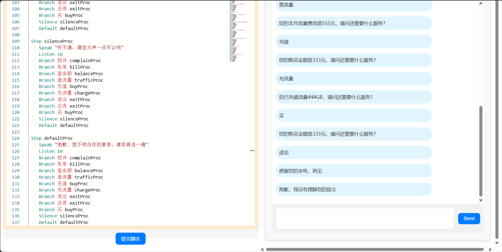
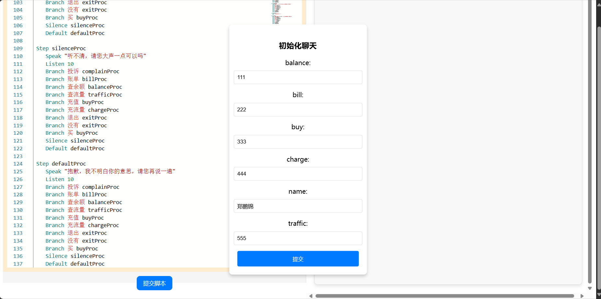
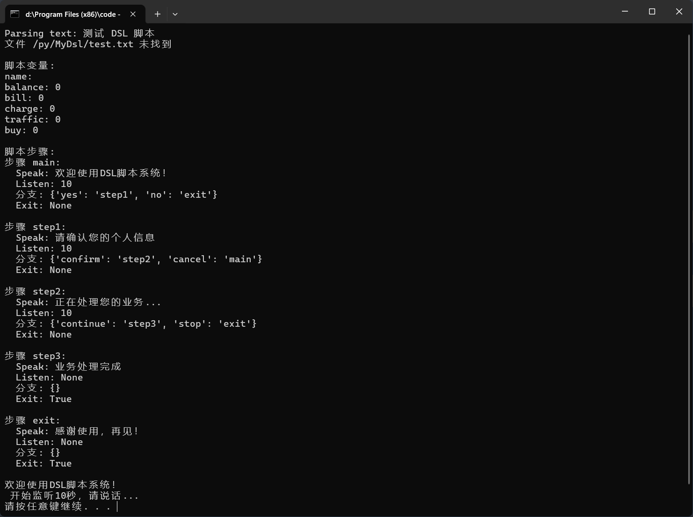
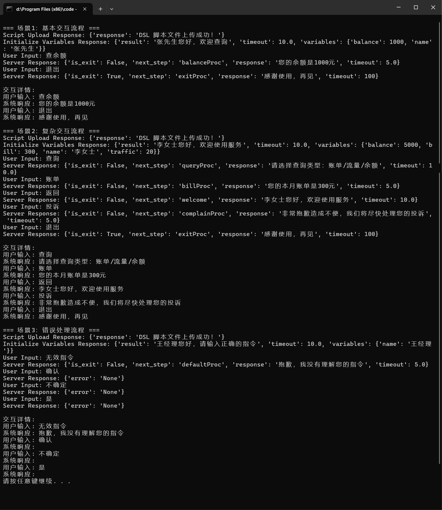
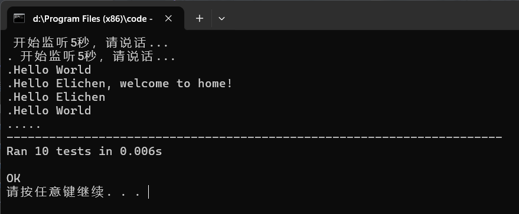
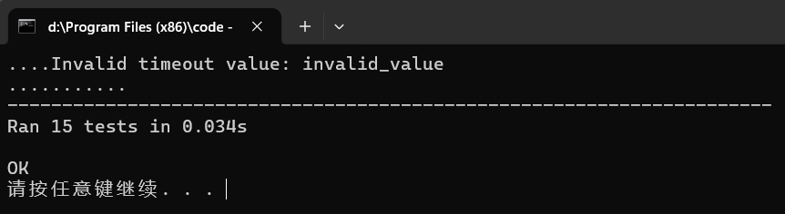

### **脚本语法规范**

------

#### **0.脚本保留字**
- Step
- Speak
- Listen
- Branch
- Silence
- Default
- Exit

------

#### **1. 基本规则**

- **注释**：以 `#` 开头的行表示注释，解析器会忽略。
- **空行**：会被解析器忽略。
- **指令格式**：指令以空格分隔，指令名后跟随参数。以`#`开头的参数会被注释。

------

#### **2. 步骤定义**

每个步骤以 `Step` 开头，后跟步骤的唯一标识符，后续指令用于定义该步骤的逻辑。
```plaintext
Step <stepID>
    <指令>
```

- `<stepID>`：步骤的唯一标识符，字符串类型。

------

#### **3. 指令**

以下是支持的指令及其语法：

##### **3.1 Speak**

设置当前步骤的对话内容。

```plaintext
Speak <文本表达式>
```

- `<文本表达式>`：可以包含普通文本、变量（以 `$` 开头）和字符串拼接符号 `+`。

- 例子：

  ```plaintext
  Speak "您好，请问有什么可以帮您？"
  Speak $name + "您好，请问需要什么服务？"
  ```

##### **3.2 Listen**

设置当前步骤监听用户输入的超时时间。

```plaintext
Listen <超时时间>
```

- `<超时时间>`：监听的最大时长（秒），支持整数或浮点数。

- 例子：

  ```plaintext
  Listen 10
  ```

##### **3.3 Branch**

设置用户输入与跳转步骤的映射关系。

```plaintext
Branch <用户输入> <目标步骤ID>
```

- `<用户输入>`：触发分支的具体输入内容。

- `<目标步骤ID>`：跳转的目标步骤标识符。

- 例子：

  ```plaintext
  Branch 投诉 complainProc
  Branch 查余额 balanceProc
  ```

##### **3.4 Silence**

设置静默状态下的跳转步骤。

```plaintext
Silence <目标步骤ID>
```

- `<目标步骤ID>`：静默时跳转的目标步骤标识符。

- 例子：

  ```plaintext
  Silence silenceProc
  ```

##### **3.5 Default**

设置默认跳转的步骤。

```plaintext
Default <目标步骤ID>
```

- `<目标步骤ID>`：默认情况下跳转的目标步骤标识符。

- 例子：

  ```plaintext
  Default defaultProc
  ```

##### **3.6 Exit**

标记当前步骤为对话结束点。

```plaintext
Exit
```

------

#### **4. 变量声明**

在对话脚本中，变量以 `$` 开头，并支持类型声明。

```plaintext
$name(type)
```

- 支持的类型：

  - `text`：文本变量。
  - `number`：数值变量（默认类型）。

- 示例：

  ```plaintext
  $name(text)
  $balance
  ```

------

#### **5. 示例脚本**

```plaintext
Step welcome
    Speak $name(text) + "您好，请问有什么可以帮您?"
    Listen 10
    Branch 查余额 balanceProc
    Silence silenceProc
    Default defaultProc

Step balanceProc
    Speak "您的余额是" + $balance + "元，请问还需要什么服务？"
    Listen 10
    Branch 投诉 complainProc
    Default defaultProc

Step exitProc
    Speak "感谢您的来电，再见"
    Exit
```

------

#### **6. 错误处理**

- **无效指令**：输出 `Invalid command: <command>`。
- **缺少参数**：输出 `Invalid command structure`。
- **变量未声明**：解析器应抛出异常并设置脚本执行状态为失败。

------

### **代码结构解析**
#### **1. Parser.py**
---

##### **类 Step**
###### **描述**
`Step` 类用于表示对话中的单个步骤。每个步骤包含与对话相关的各种属性和跳转逻辑。

###### **属性**
- `stepID`：步骤的唯一标识符。
- `speak`：当前步骤需要说的话（文本内容）。
- `listen`：监听用户输入的超时时间（以秒为单位）。
- `branch`：一个字典，根据用户输入跳转到不同的步骤，格式为 `{用户输入: 下一步骤ID}`。
- `silence`：在静默状态下跳转的步骤ID。
- `default`：默认跳转的步骤ID。
- `exit`：布尔值，表示当前步骤是否为对话结束点。

###### **方法**
1. `set_speak(expression)`  
   设置当前步骤需要说的话。
   - 参数：`expression (str)` - 文本内容。

2. `set_listen(timeout)`  
   设置监听用户输入的超时时间。
   - 参数：`timeout (int/float)` - 超时时间。

3. `set_branch(answer, next_stepID)`  
   根据用户的输入设置分支跳转。
   - 参数：
     - `answer (str)` - 用户输入内容。
     - `next_stepID (str)` - 下一步骤的ID。

4. `set_silence(next_stepID)`  
   设置静默状态下的跳转步骤。
   - 参数：`next_stepID (str)` - 静默跳转的步骤ID。

5. `set_default(next_stepID)`  
   设置默认跳转的步骤。
   - 参数：`next_stepID (str)` - 默认跳转的步骤ID。

6. `set_exit()`  
   将当前步骤标记为对话结束点。

---

##### **类 Script**
###### **描述**
`Script` 类用于存储完整的对话脚本，包括所有步骤和对话中的变量。

###### **属性**
- `mainStep`：对话的起始步骤。
- `steps`：存储所有步骤的字典，格式为 `{stepID: Step对象}`。
- `variables`：对话过程中使用的变量存储，支持文本和数字类型。
- `success`：脚本执行是否成功的标志。

###### **方法**
1. `create_step(stepId)`  
   创建新的步骤并添加到脚本中。
   - 参数：`stepId (str)` - 步骤的唯一标识符。
   - 返回：`Step` 对象。

---

##### **类 parser**
###### **描述**
`parser` 类用于解析脚本文本或文件，将其转换为 `Script` 对象，支持对话步骤和逻辑的自动化解析。

###### **属性**
- `script`：存储解析后的脚本对象（`Script` 类型）。
- `currentStep`：当前正在处理的步骤。

###### **方法**
1. `parseText(text)`  
   从文本中解析脚本。
   - 参数：`text (str)` - 包含脚本语言的文本内容。

2. `parseFile(file_name)`  
   从文件中解析脚本。
   - 参数：`file_name (str)` - 文件路径。

3. `parseLine(line)`  
   解析单行脚本指令。
   - 参数：`line (str)` - 单行脚本内容。

4. `ProcessTokens(token)`  
   处理解析后的指令标记。
   - 参数：`token (list)` - 指令标记列表。

---

##### **解析器的指令处理方法**
1. `ProcessStep(stepID)`  
   创建一个新的步骤。
   - 参数：`stepID (str)` - 步骤的唯一标识符。

2. `ProcessSpeak(text)`  
   设置当前步骤的对话内容。
   - 参数：`text (list)` - 对话内容的标记列表。

3. `ProcessListen(timeout)`  
   设置当前步骤的监听超时时间。
   - 参数：`timeout (str)` - 超时时间。

4. `ProcessBranch(answer, stepID)`  
   设置分支跳转逻辑。
   - 参数：
     - `answer (str)` - 用户输入内容。
     - `stepID (str)` - 下一步骤ID。

5. `ProcessSilence(stepID)`  
   设置静默状态下的跳转步骤。
   - 参数：`stepID (str)` - 静默跳转的步骤ID。

6. `ProcessDefault(stepID)`  
   设置默认跳转的步骤。
   - 参数：`stepID (str)` - 默认跳转的步骤ID。

7. `ProcessExit()`  
   将当前步骤标记为对话结束点。

---

##### **脚本语言支持的指令**
- **Step [stepID]**：定义一个新步骤。
- **Speak "文本内容"**：设置当前步骤的对话文本。
- **Listen [timeout]**：设置监听用户输入的超时时间。
- **Branch [answer] [next_stepID]**：设置分支跳转逻辑。
- **Silence [next_stepID]**：设置静默状态下的跳转步骤。
- **Default [next_stepID]**：设置默认跳转步骤。
- **Exit**：标记当前步骤为对话结束点。

------
#### **2. Interpreter.py**

##### **类 Interpreter**

###### **描述**

`Interpreter` 类是一个对话脚本的解释器，负责执行解析器生成的脚本，处理对话的逻辑和步骤跳转。

###### **属性**

- `parser`：解析器对象（`Parser`），包含已解析的脚本信息。
- `script`：脚本对象（`Script`），由解析器生成，包含所有步骤和变量。
- `currentStep`：当前正在执行的步骤对象。
- `variables`：脚本中定义的变量字典，用于存储和替换对话中的动态内容。
- `user_input`：用户输入内容，初始为 `None`。
- `is_exit`：布尔值，标志对话是否结束。

------

##### **方法**

###### **1. `__init__(self, parser)`**

**描述**：
 初始化 `Interpreter` 对象并加载解析器和脚本。

**参数**：

- `parser (Parser)`：解析器对象。

**功能**：

- 初始化 `script`、`currentStep`、`variables` 等属性。
- 设置 `user_input` 和 `is_exit` 的初始值。

------

###### **2. `execute(self)`**

**描述**：
 脚本的主执行方法，依次遍历并处理每个步骤。

**功能**：

- 执行当前步骤的对话（`speak`）。
- 处理监听逻辑（`listen`）。
- 根据用户输入或默认逻辑跳转到下一步骤。
- 检查对话是否结束。

**返回**：

- `str`：当前步骤的响应文本。

------

###### **3. `execSpeak(self, text)`**

**描述**：
 处理并输出当前步骤的对话文本。

**参数**：

- `text (str)`：需要输出的文本内容。

**功能**：

- 使用正则表达式替换文本中的变量，支持两种变量语法：
  - `$(变量名)`
  - `$变量名`
- 清理文本中的多余符号（如引号）。
- 更新当前步骤的 `speak` 内容。

**返回**：

- `str`：替换变量后的最终文本。

------

###### **4. `execListen(self, timeout)`**

**描述**：
 监听用户输入，模拟监听逻辑。

**参数**：

- `timeout (float)`：监听的超时时间（以秒为单位）。

**功能**：

- 打印监听提示信息。
- 返回 `user_input` 的内容，如果没有输入，则返回空字符串。

**返回**：

- `str`：用户输入内容。

------

###### **5. `setUserInput(self, user_input)`**

**描述**：
 设置用户输入的内容，用于模拟用户输入或从前端获取输入。

**参数**：

- `user_input (str)`：用户的输入内容。

**功能**：

- 将用户输入存储到 `user_input` 属性中。

------

###### **6. `getNextStep(self, userInput)`**

**描述**：
 根据用户输入的内容确定下一步的逻辑跳转。

**参数**：

- `userInput (str)`：用户的输入内容。

**功能**：

- 如果对话已结束（`is_exit=True`），返回 `None`。
- 如果输入为空或为静默（`silence`），跳转到 `silence` 分支。
- 检查输入是否匹配 `branch` 条件，跳转到对应步骤。
- 如果以上条件均未满足，跳转到 `default` 步骤。

**返回**：

- `str/None`：下一步骤的标识符，若对话结束返回 `None`。

------

##### **方法的工作流程**

###### **1. 主方法 `execute`**

- 调用 `execSpeak` 输出对话文本。
- 检查 `exit` 标志是否为 `True`，若是则退出。
- 调用 `execListen` 获取用户输入。
- 调用 `getNextStep` 确定下一步骤。

###### **2. 文本处理方法 `execSpeak`**

- 使用正则表达式匹配变量语法。
- 替换变量后输出处理后的文本。

###### **3. 用户输入方法 `execListen` 和 `setUserInput`**

- 模拟用户输入的监听和设置逻辑。

###### **4. 步骤跳转方法 `getNextStep`**

- 根据用户输入检查分支跳转条件。
- 处理静默场景和默认跳转逻辑。

------

##### **示例脚本和执行流程**

###### **示例脚本**

```plaintext
Step greeting
Speak "你好，我是助手，您可以输入 $name。"
Listen 5
Branch "天气" weather
Default goodbye

Step weather
Speak "今天的天气很好，适合外出。"
Exit

Step goodbye
Speak "感谢您的咨询，再见！"
Exit
```

###### **示例执行**

```python
# 初始化解析器和解释器
parser = Parser()
parser.parseText(script_text)
interpreter = Interpreter(parser)

# 设置用户输入
interpreter.setUserInput("天气")

# 执行脚本
response = interpreter.execute()
print(response)  # 输出: "今天的天气很好，适合外出。"
```

------

##### **正则表达式说明**

- ```
  \$\((\w+)\)|\$(\w+)
  ```

  ：匹配两种变量语法：

  - `$(变量名)`
  - `$变量名`

- 替换逻辑：

  - 如果变量名存在于 `variables` 字典中，用对应值替换。
  - 如果变量未找到，保留原始文本。

------
#### **3. app.py**
---


##### **模块描述**
该 Flask 应用提供了一个基于 DSL（领域特定语言）的对话系统服务，允许用户上传 DSL 脚本文件、初始化系统变量、处理用户输入并动态生成对话响应。  
主要功能包括：
- DSL 脚本上传和解析。
- 系统变量初始化。
- 用户输入处理。
- 动态对话管理。

---

##### **全局变量**
- `parser`：全局 DSL 解析器实例。
- `interpreter`：全局解释器实例，用于执行解析后的脚本。

---

##### **路由**

###### **1. `/dataInit`**
**描述**：  
初始化数据，将脚本中的变量转换为前端可识别的格式。

**方法**：`POST`

**功能**：
- 提取脚本中的变量。
- 根据变量类型（文本或数字）生成 JSON 响应。

**返回**：
- **成功**：`200`，返回变量列表及其类型。
  ```json
  {
    "variables": {
      "name": {"value": "Alice", "type": "text"},
      "age": {"value": 25, "type": "number"}
    }
  }
  ```

---

###### **2. `/initialize`**
**描述**：  
初始化 DSL 系统变量，将用户提交的变量值加载到解释器中。

**方法**：`POST`

**功能**：
- 接收用户提交的变量值。
- 更新解释器中的变量字典。
- 执行脚本的初始步骤，并返回响应文本和变量状态。

**请求参数**（JSON）：
```json
{
  "name": {"value": "Alice"},
  "age": {"value": 25}
}
```

**返回**：
- **成功**：`200`，返回初始执行结果、变量状态和监听超时时间。
  ```json
  {
    "result": "你好，Alice",
    "variables": {"name": "Alice", "age": 25},
    "timeout": 5
  }
  ```
- **失败**：`400`，返回错误信息。

---

###### **3. `/process`**
**描述**：  
处理用户输入并根据 DSL 脚本逻辑生成下一步的响应。

**方法**：`POST`

**功能**：
- 接收用户输入。
- 调用解释器的 `setUserInput` 和 `getNextStep` 方法。
- 根据用户输入跳转到下一步骤。
- 执行下一步骤的 `speak` 和 `listen` 部分。
- 检查是否需要退出对话。

**请求参数**（JSON）：
```json
{
  "input": "天气"
}
```

**返回**：
- **成功**：`200`，返回响应文本、下一步骤 ID、退出标志和监听超时时间。
  ```json
  {
    "response": "今天的天气很好。",
    "next_step": "weather",
    "is_exit": false,
    "timeout": 5
  }
  ```
- **失败**：`500`，返回错误信息。

---

###### **4. `/upload`**
**描述**：  
上传 DSL 脚本文件并解析生成脚本结构。

**方法**：`POST`

**功能**：
- 接收 DSL 脚本内容。
- 调用解析器解析脚本。
- 初始化解释器。
- 返回脚本解析结果。

**请求参数**（JSON）：
```json
{
  "input": "Step greeting\nSpeak \"你好，欢迎！\"\nExit"
}
```

**返回**：
- **成功**：`200`，返回上传成功的消息。
  ```json
  {
    "response": "DSL 脚本文件上传成功！"
  }
  ```
- **失败**：`500`，返回错误信息。

---

##### **辅助模块和类**

###### **1. `Parser` 模块**
**功能**：
- 提供 DSL 脚本的解析功能。
- 将文本脚本转换为脚本对象，包含步骤和变量信息。

###### **2. `Interpreter` 模块**
**功能**：
- 提供 DSL 脚本的执行功能。
- 管理对话步骤、变量替换、用户输入处理和逻辑跳转。

---

##### **代码逻辑概览**

1. **DSL 脚本上传**
   - 通过 `/upload` 路由接收并解析脚本。
   - 初始化全局解析器和解释器。

2. **系统变量初始化**
   - 通过 `/initialize` 路由接收用户提交的变量值。
   - 更新解释器变量并执行脚本的初始步骤。

3. **用户输入处理**
   - 通过 `/process` 路由接收用户输入。
   - 根据 DSL 脚本逻辑生成响应并跳转到下一步骤。

4. **数据初始化**
   - 通过 `/dataInit` 路由返回脚本变量的初始状态。

---

##### **示例执行流程**

###### **DSL 脚本**
```plaintext
Step greeting
Speak "你好，我是助手，请告诉我您的名字。"
Listen 5
Default ask_weather

Step ask_weather
Speak "请问您想查询什么？"
Listen 5
Branch "天气" weather
Default goodbye

Step weather
Speak "今天的天气是晴天。"
Exit

Step goodbye
Speak "感谢您的咨询，再见！"
Exit
```

###### **前端交互**
1. **上传脚本**
   - 调用 `/upload` 路由上传脚本。
   - 返回成功消息。

2. **初始化变量**
   - 调用 `/initialize` 路由提交变量。
   - 返回初始响应和变量状态。

3. **处理用户输入**
   - 调用 `/process` 路由提交输入。
   - 返回响应文本和下一步骤。

---
##### 文件概述：`app.vue`

###### 1. 功能描述
该文件是 Vue.js 单文件组件 (`App.vue`)，作为主应用组件，用于集成 DSL（领域特定语言）脚本编辑器和聊天交互界面。主要功能包括：
- 提供 Monaco 代码编辑器以编写和编辑 DSL 脚本。
- 支持将编写好的脚本上传到后端服务器。
- 动态加载并显示聊天界面，在脚本上传成功后启用。

###### 2. 结构分析
- **模板部分 (`<template>`)**: 包含应用的布局和基本 UI 元素。
  - 主容器 (`div.app-container`) 使用 flex 布局，分为两部分：编辑器区域和聊天区域。
  - 编辑器段 (`div.editor-section`) 包含 Monaco 编辑器和一个提交按钮。
  - 聊天段 (`div.chat-section`) 在条件渲染的基础上显示聊天组件 (`<Chat />`)。
  
- **脚本部分 (`<script setup>`)**
  - 导入所需组件 `MonacoEditor` 和 `Chat`，以及 Vue 的响应式引用 `ref` 和异步请求库 `axios`。
  - 使用了两个反应变量 `scriptSubmitted` 和 `code` 用于管理状态。
  - 定义了一个异步函数 `submitScript` 用于处理脚本上传逻辑，并在成功时更新 `scriptSubmitted` 以显示聊天界面。

- **样式部分 (`<style>`)**
  - 对整个应用容器进行样式的定义，特别是针对编辑器与聊天区域的布局进行了详细的设置。
  - 同时为提交按钮添加了一些基础样式及悬停效果以改善用户体验。

###### 3. 关键代码点
- **Monaco 编辑器**：通过 `v-model` 绑定了 `code` 变量以实现数据双向绑定。
- **脚本提交**：`submitScript` 函数负责向指定 URL 发送 POST 请求，上传当前编辑器中的内容，并根据结果更新界面状态。
- **状态控制**：`scriptSubmitted` 用来决定是否展示聊天组件，确保用户只有在完成脚本上传后才能进入对话模式。

总结来说，这个组件结合使用了第三方库 (如 Monaco Editor) 和标准的 Vue 开发工具 (如 Composition API)，构建了一个具有交互性且功能齐全的应用入口点。

##### 文件概述 `Chat.vue`

**文件类型**: Vue 组件

###### 功能概述
该文件是一个 Vue 组件，用于实现一个聊天界面。组件的主要功能包括：
1. **初始化弹窗**: 在聊天界面未初始化时显示一个表单，用户需要填写表单以完成初始化。
2. **聊天消息显示区**: 显示聊天消息，支持滚动。
3. **用户输入区域**: 提供一个文本输入框和发送按钮，用户可以输入消息并发送。

###### 主要组件结构
- **模板 (Template)**:
  - 使用条件渲染 (`v-if`) 来控制不同状态下的 UI 显示。
  - 初始化阶段显示一个表单，用户填写后提交。
  - 初始化完成后显示聊天消息和用户输入区域。

- **脚本 (Script)**:
  - 使用 Vue Composition API (`setup` 函数) 来定义状态和逻辑。
  - **状态管理**:
    - `messageInput`: 存储用户输入的消息。
    - `messages`: 存储聊天消息的数组。
    - `initialized`: 标记是否已完成初始化。
    - `initData`: 存储从后端获取的初始化数据。
  - **初始化数据获取**:
    - `getInitData`: 从后端获取初始化数据并填充表单。
  - **初始化提交**:
    - `submitInitialization`: 提交初始化数据并将结果添加到聊天记录中。
  - **消息发送**:
    - `handleSend`: 处理用户输入并发送到后端。
    - `sendMessageToBackend`: 将消息发送到后端并处理响应。
  - **静默定时器**:
    - `resetSilenceTimer`: 如果用户长时间无操作，则定期发送空字符串以保持会话活跃。
    - `stopSilenceTimer`: 停止静默定时器。

- **样式 (Style)**:
  - 定义了初始化弹窗、聊天消息容器、输入区域等的样式，确保界面美观且易于使用。

###### 关键逻辑
- 从后端获取初始化数据并动态生成表单。
- 用户提交初始化数据后，开始聊天。
- 用户输入消息并通过 Axios 发送到后端，接收响应后显示在聊天记录中。
- 静默定时器在用户长时间无操作时定期发送空字符串以保持会话活跃。

这个组件为用户提供了一个完整的聊天体验，从初始化到与后端通信，再到显示聊天记录。

#### 文件概述 `MonacoEditor.vue`

**描述**: 该组件是一个基于微软 Monaco Editor 的代码编辑器，支持代码编辑、语法高亮和智能提示。它提供了一个可定制的编辑器，允许用户自定义初始值、编程语言和主题。

##### 主要功能
- **代码编辑**: 支持多种编程语言。
- **语法高亮**: 自动为不同类型的代码提供颜色高亮。
- **智能提示**: 提供代码建议和自动完成功能。
- **双向绑定**: 使用 Vue 的 `v-model` 实现内容的双向绑定。

##### 组件属性
- **modelValue**: 编辑器的内容（默认为空字符串）。
- **language**: 编程语言类型（默认为 JavaScript）。
- **theme**: 编辑器主题（默认为 VS 标准主题）。

##### 事件
- **update:modelValue**: 当编辑器内容变化时触发，用于更新父组件中的值。

##### 生命周期钩子
- **onMounted**: 在组件挂载时初始化 Monaco 编辑器。
- **onBeforeUnmount**: 在组件卸载前销毁编辑器实例，避免内存泄漏。
- **watch**: 监听 `modelValue` 变化，并同步编辑器内容。

##### 模板
- **编辑器容器**: `<div ref="editorContainer" class="monaco-editor"></div>`

##### 样式
- **编辑器容器样式**: 设置最大宽度、内边距、高度和背景色。
- **行号宽度**: 自定义行号区域的宽度。

##### 依赖
- **monaco-editor**: 用于创建代码编辑器实例。
- **Vue 3**: 使用组合式 API (`<script setup>`) 和响应式系统 (`ref`, `watch`, `onMounted`, `onBeforeUnmount`, `defineProps`, `defineEmits`)。

##### 注意事项
- 该组件使用了 Monaco Editor 的多个配置选项，如自动布局、代码折叠、行号点击选中整行等。
- 通过 `inject` 可以注入其他依赖，但在此示例中未使用。

---
### **模块划分**
主要分为 `Interpreter_fixed.py` \ `Parser.py` \ `app.py` \ `Chat.vue` \ `app.vue` \ `MonacoEditor.vue` 六个模块。

#### `Interpreter_fixed.py`

脚本执行模块，用于执行Parser解析的脚本。

#### `Parser.py`

脚本解析模块，用于解析给定的Script脚本。

#### `app.py`

前后端连接模块，采用Flask框架，针对前端给出的输入输出进行相应。

#### `Chat.vue`

聊天框模块，用户在此模块进行输入，可得到相应的回复。

#### `app.vue`

前端模块，调用Chat，Monaco-editor组件。

#### `MonacoEditor.vue`

脚本输入模块，在此处根据不同场景输入不同的模块。
### **用户接口**
---
###### **采用前端界面，简洁清晰明了。**


---
### **程序间接口**
---
以下是上述几个文件之间的程序间接口的设计，包括模块功能和方法调用的接口定义。

------

##### **文件间接口设计**

#### **1. `Parser` 模块**

**功能**：
 负责解析 DSL 脚本文件，将其转换为可执行的脚本结构。

**接口定义**：

- **`Parser.parseText(script_text: str) -> None`**

  - **描述**：解析 DSL 脚本文本。
  - **参数**：
     `script_text`：DSL 脚本的内容（字符串）。
  - **效果**：更新 `Parser` 对象的 `script` 属性。
  - **使用场景**：由 `upload` 路由调用，用于解析上传的脚本。

- **`Parser.script`**

  - **描述**：解析后的脚本对象。

  - 结构

    ：

    ```python
    {
        "mainStep": <Step对象>,   # 主步骤
        "steps": {                # 所有步骤的映射
            "step_id": <Step对象>
        },
        "variables": {            # 定义的变量
            "variable_name": <value>
        },
        "success": <bool>         # 脚本解析是否成功
    }
    ```

------

###### **2. `Interpreter` 模块**

**功能**：
 负责执行解析后的 DSL 脚本，处理对话步骤逻辑。

**接口定义**：

- **`Interpreter.__init__(parser: Parser)`**

  - **描述**：初始化解释器对象。
  - **参数**：
     `parser`：`Parser` 对象，包含已解析的脚本信息。
  - **效果**：加载解析后的脚本，并准备执行。

- **`Interpreter.execute() -> str`**

  - **描述**：执行当前步骤，返回输出内容。
  - **返回**：
     当前步骤的响应文本（字符串）。
  - **使用场景**：由 `/initialize` 路由调用，执行初始步骤。

- **`Interpreter.setUserInput(user_input: str) -> None`**

  - **描述**：设置用户输入内容。
  - **参数**：
     `user_input`：用户输入的字符串。
  - **使用场景**：由 `/process` 路由调用，用于更新用户输入。

- **`Interpreter.getNextStep(userInput: str) -> str | None`**

  - **描述**：根据用户输入决定下一个步骤。
  - **参数**：
     `userInput`：用户输入的字符串。
  - **返回**：
     下一步骤的标识符（字符串），如果对话结束返回 `None`。
  - **使用场景**：由 `/process` 路由调用，用于跳转到下一步骤。

- **`Interpreter.execSpeak(text: str) -> str`**

  - **描述**：处理当前步骤的输出文本（变量替换）。
  - **参数**：
     `text`：包含变量占位符的字符串。
  - **返回**：
     替换后的文本内容。
  - **使用场景**：由 `/process` 路由调用，用于生成当前步骤的响应。

- **`Interpreter.execListen(timeout: float) -> str`**

  - **描述**：模拟监听用户输入。
  - **参数**：
     `timeout`：监听的超时时间。
  - **返回**：
     用户输入内容或默认值（`'silence'`）。
  - **使用场景**：由 `/process` 路由调用，用于获取用户输入。

- **`Interpreter.variables`**

  - **描述**：存储脚本中定义的变量字典。

  - 使用场景

    ：

    - 由 `/initialize` 路由读取并更新。
    - 由 `/process` 路由读取当前变量状态。

- **`Interpreter.is_exit`**

  - **描述**：标志当前对话是否结束。
  - **使用场景**：由 `/process` 路由检查对话是否完成。

------

###### **3. `Flask` 应用接口**

**功能**：
 提供 RESTful API，供前端交互和脚本上传使用。

**接口定义**：

- **`POST /dataInit`**
  - **描述**：初始化脚本变量，返回前端可识别的格式。
  - **返回**：JSON 格式的变量字典。
- **`POST /initialize`**
  - **描述**：初始化 DSL 系统变量，执行脚本的初始步骤。
  - **参数**：用户提交的变量值。
  - **返回**：响应文本、变量状态、监听超时时间。
- **`POST /process`**
  - **描述**：处理用户输入并生成下一步骤的响应。
  - **参数**：用户输入字符串。
  - **返回**：响应文本、下一步骤标识符、退出标志、监听超时时间。
- **`POST /upload`**
  - **描述**：上传并解析 DSL 脚本文件。
  - **参数**：DSL 脚本内容。
  - **返回**：上传和解析结果。

------

##### **模块调用关系**

1. **脚本上传**
   - `Flask` -> `/upload` -> `Parser.parseText()`
   - 初始化 `Interpreter`。
2. **初始化变量**
   - `Flask` -> `/initialize` -> `Interpreter.variables`
      更新变量并执行 `Interpreter.execute()`。
3. **处理用户输入**
   - `Flask` -> `/process` -> `Interpreter.setUserInput()`
      根据输入跳转到下一步骤，调用 `Interpreter.execSpeak()` 生成响应。
4. **数据初始化**
   - `Flask` -> `/dataInit` -> `Interpreter.variables`
      返回变量的初始状态。

------

### **前后端接口格式**

#### **1. 前端上传 DSL 脚本**

- 请求

  ：

  ```json
  {
    "input": "Step greeting\nSpeak \"你好\"\nExit"
  }
  ```

- 响应

  ：

  ```json
  {
    "response": "DSL 脚本文件上传成功！"
  }
  ```

#### **2. 前端初始化变量**

- 请求

  ：

  ```json
  {
    "name": {"value": "Alice"},
    "age": {"value": 25}
  }
  ```

- 响应

  ：

  ```json
  {
    "result": "你好，Alice",
    "variables": {"name": "Alice", "age": 25},
    "timeout": 5
  }
  ```

#### **3. 前端处理用户输入**

- 请求

  ：

  ```json
  {
    "input": "天气"
  }
  ```

- 响应

  ：

  ```json
  {
    "response": "今天的天气很好。",
    "next_step": "weather",
    "is_exit": false,
    "timeout": 5
  }
  ```

#### **4. 前端获取变量初始化数据**

- **请求**：无

- 响应

  ：

  ```json
  {
    "variables": {
      "name": {"value": "Alice", "type": "text"},
      "age": {"value": 25, "type": "number"}
    }
  }
  ```

### **测试情况** 

#### 1.**测试桩**

- StubParser.py

  对Parser进行屏蔽，只返回固定数据。

- StubFrontEnd.py
  屏蔽Vue前端，只返回固定数据。

#### **2.单元测试**
引入`Python`的`unittest`模块，对`Interpreter`与`Parser`进行测试。
- testInterpreter.py

- testParser.py


### **使用方法**

#### **1. 启动服务**
在MyDsl目录下，执行
```bash
python app.py
```
在dsl-app目录下，执行
```bash
npm run serve
```

#### **2. 浏览器访问**

```
http://localhost:8080/
```

#### **3. 上传 DSL 脚本**

- 选择文件
- 复制脚本内容
- 点击上传

#### **4. 初始化变量**

- 输入变量值
- 点击初始化

#### **5. 处理用户输入**

- 输入用户输入
- 点击提交

#### **6. 输出结果**

- 输出结果